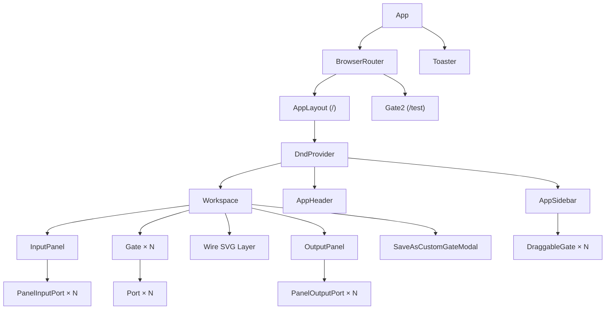
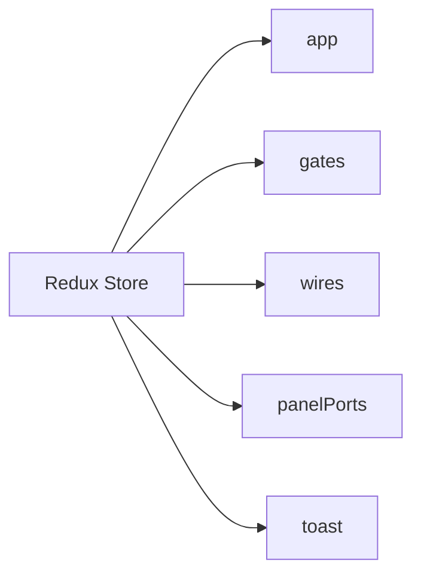
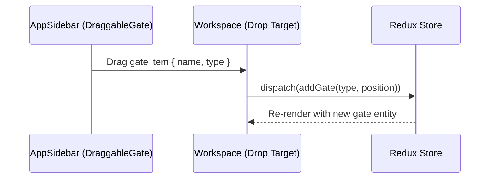
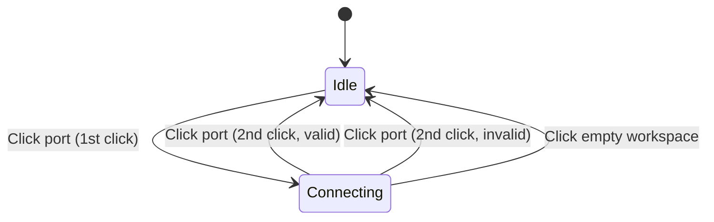

# Gatey — System Architecture

This document describes the complete system architecture of Gatey, a browser-based digital logic circuit simulator.

---

## High-Level Overview

Gatey is a **client-side only** single-page application (SPA). There is no backend server — all circuit simulation, rendering, and persistence runs entirely within the user's browser.

```
┌─────────────────────────────────────────────────────┐
│                      Browser                        │
│                                                     │
│  ┌─────────────────────────────────────────────┐    │
│  │                React SPA                    │    │
│  │                                             │    │
│  │  ┌──────────┐  ┌───────────┐  ┌──────────┐ │    │
│  │  │ UI Layer │  │ State     │  │ Sim      │ │    │
│  │  │ (React   │◄─┤ (Redux   │◄─┤ Engine   │ │    │
│  │  │  + DnD)  │  │  Toolkit) │  │ (Middle- │ │    │
│  │  │          │──►│          │──►│  ware)   │ │    │
│  │  └──────────┘  └───────────┘  └──────────┘ │    │
│  │                     │                       │    │
│  │                     ▼                       │    │
│  │              ┌─────────────┐                │    │
│  │              │ localStorage│                │    │
│  │              │ (Custom     │                │    │
│  │              │  Gates)     │                │    │
│  │              └─────────────┘                │    │
│  └─────────────────────────────────────────────┘    │
└─────────────────────────────────────────────────────┘
```

---

## Technology Stack

| Layer                 | Technology                               | Version     | Purpose                                                       |
| --------------------- | ---------------------------------------- | ----------- | ------------------------------------------------------------- |
| **Build**             | Vite                                     | 6.x         | Dev server, HMR, production bundling                          |
| **UI Framework**      | React                                    | 19.x        | Component-based rendering                                     |
| **Component Library** | CoreUI React                             | 5.x         | Pre-built UI components (Sidebar, Header, Modal, Toast, etc.) |
| **State Management**  | Redux Toolkit                            | 2.x         | Centralized, predictable state                                |
| **Drag & Drop**       | React DnD (HTML5 Backend)                | 16.x        | Gate placement and wiring interactions                        |
| **Routing**           | React Router DOM                         | 7.x         | SPA client-side routing                                       |
| **Styling**           | CoreUI CSS + Sass + Bootstrap utilities  | —           | Theming, responsive layout, custom styles                     |
| **Icons**             | Font Awesome (self-hosted), CoreUI Icons | —           | Icon set for UI elements                                      |
| **Typography**        | Google Fonts (Nunito)                    | —           | Custom font family                                            |
| **Persistence**       | localStorage                             | Browser API | Saving custom gates                                           |

---

## Directory Structure

```
Gatey/
├── README.md                          # Project overview
├── backend/                           # (empty — reserved for future)
├── docs/                              # Documentation
│   ├── SETUP.md
│   ├── ARCHITECTURE.md                # (this file)
│   ├── DATA_PIPELINE.md
│   └── DESIGN_DECISIONS.md
└── frontend/
    ├── index.html                     # HTML entry point
    ├── package.json                   # Dependencies & scripts
    ├── vite.config.js                 # Vite configuration
    ├── eslint.config.js               # Linting rules
    ├── public/
    │   ├── fonts/FontAwesome/         # Self-hosted FA icons
    │   ├── img/                       # Static images (avatars)
    │   ├── logo/                      # Gatey brand assets
    │   └── vite.svg                   # Favicon
    └── src/
        ├── main.jsx                   # App entry — Redux Provider + StrictMode
        ├── App.jsx                    # Root component — BrowserRouter + Routes
        ├── App.css                    # (empty/unused)
        ├── index.css                  # Google Fonts import
        ├── assets/                    # Bundled assets (react.svg)
        ├── layout/
        │   └── appLayout.jsx          # Main layout shell (Sidebar + Header + Workspace)
        ├── Components/
        │   ├── AppSidebar.jsx         # Gate palette with drag sources
        │   ├── AppHeader.jsx          # Top bar — title, theme toggle, user dropdown
        │   ├── AppHeaderDropdown.jsx  # User avatar dropdown menu
        │   ├── AppBreadcrumb.jsx      # Route-based breadcrumb (currently unused)
        │   ├── ContextMenu.jsx        # Right-click context menu (Edit/Inspect/Delete)
        │   ├── Toaster.jsx            # Toast notification system
        │   ├── gate/
        │   │   ├── Gate.jsx           # Draggable gate component with input/output ports
        │   │   └── Gate.css           # Gate styling
        │   ├── wire/
        │   │   └── Wire.jsx           # SVG path-based wire with value-driven coloring
        │   └── workspace/
        │       ├── Workspace.jsx      # Main canvas — drop target, connection logic, SVG overlay
        │       ├── Workspace.css      # Z-index layering (wires behind gates)
        │       ├── inputPanel.jsx     # Left panel — togglable input ports
        │       ├── OutputPanel.jsx    # Right panel — read-only output ports
        │       └── SaveAsCustomGateModal.jsx  # Modal to save circuit as custom gate
        ├── store/
        │   ├── index.js              # Redux store configuration
        │   ├── appSlice.js           # App-level UI state (sidebar visibility, theme)
        │   ├── gatesSlice.js         # Gate entities — CRUD + state management
        │   ├── wiresSlice.js         # Wire entities — connections + signal values
        │   ├── panelPortsSlice.js    # Input/Output panel ports — toggle, rename, CRUD
        │   ├── toastSlice.js         # Toast notifications stack
        │   └── middleware/
        │       └── simulationMiddleware.js  # Signal propagation engine (7 listeners)
        ├── utils/
        │   ├── circuitLogic.js       # Boolean gate evaluation functions
        │   └── customGate.js         # localStorage persistence for custom gates
        ├── scss/
        │   └── custom.scss           # CoreUI theme overrides (font, sizing)
        └── test/
            └── gate/
                └── Gate2.jsx         # Experimental test component
```

---

## Component Architecture

The UI is organized in a hierarchical layout based on the CoreUI admin template pattern:



### Component Responsibilities

| Component                 | File                        | Responsibility                                                                                                                     |
| ------------------------- | --------------------------- | ---------------------------------------------------------------------------------------------------------------------------------- |
| **App**                   | `App.jsx`                   | Root — sets up routing, wraps app in `BrowserRouter`, renders `Toaster`                                                            |
| **AppLayout**             | `appLayout.jsx`             | Main layout shell — wraps everything in `DndProvider`, arranges Sidebar + Header + Workspace                                       |
| **AppSidebar**            | `AppSidebar.jsx`            | Left panel — renders draggable gate palette (basic + custom), reads saved custom gates from `localStorage`                         |
| **AppHeader**             | `AppHeader.jsx`             | Top bar — sidebar toggler, app title ("Logic Gate Lab"), notification icons, theme switcher (light/dark/auto), user dropdown       |
| **AppHeaderDropdown**     | `AppHeaderDropdown.jsx`     | User profile dropdown — avatar, account links, logout                                                                              |
| **Workspace**             | `Workspace.jsx`             | Central canvas — drop target for gates, manages connection state machine, renders gates + wire SVG overlay + "Save as Gate" button |
| **Gate**                  | `Gate.jsx`                  | Individual logic gate — draggable via React DnD, renders input/output `Port` components, supports right-click context menu         |
| **Port**                  | Inside `Gate.jsx`           | Single I/O port on a gate — click to start/complete connection, color reflects boolean value                                       |
| **Wire**                  | `Wire.jsx`                  | SVG `<path>` connecting two ports — dynamic color (lime = ON, dark red = OFF), recalculates path on layout changes                 |
| **InputPanel**            | `inputPanel.jsx`            | Left I/O panel — add/toggle/rename/delete input ports, each port acts as a wire source                                             |
| **OutputPanel**           | `OutputPanel.jsx`           | Right I/O panel — add/rename/delete output ports, each port acts as a wire sink, displays propagated values                        |
| **SaveAsCustomGateModal** | `SaveAsCustomGateModal.jsx` | Modal dialog — captures current circuit snapshot (gates, wires, I/O ports) and saves to `localStorage` as a named custom gate      |
| **ContextMenu**           | `ContextMenu.jsx`           | Generic right-click menu — Edit, Inspect, Delete options                                                                           |
| **Toaster**               | `Toaster.jsx`               | Toast notification overlay — auto-dismiss after 10 seconds, shows relative time                                                    |
| **AppBreadcrumb**         | `AppBreadcrumb.jsx`         | Route-based breadcrumb — currently commented out in the layout                                                                     |

---

## State Management Architecture

All application state is managed through a centralized **Redux Toolkit** store.

### Store Structure



### Slice Details

#### `appSlice` — UI State

| Field               | Type      | Default   | Purpose                                            |
| ------------------- | --------- | --------- | -------------------------------------------------- |
| `sidebarShow`       | `boolean` | `true`    | Controls sidebar visibility                        |
| `sidebarUnfoldable` | `boolean` | `true`    | Controls sidebar collapse behavior                 |
| `theme`             | `string`  | `"light"` | Color theme (managed via CoreUI's `useColorModes`) |

**Actions:** `setSidebarShow`, `setSidebarUnfoldable`

#### `gatesSlice` — Logic Gate Entities

Uses a normalized entity pattern: `{ entities: {}, ids: [] }`

**Entity shape:**

```javascript
{
  id: "nanoid-string",
  type: "AND" | "NOT" | <custom>,
  position: { x: number, y: number },
  ports: {
    inputs:  [{ id: "in1", label: "A", type: "input" }, ...],
    outputs: [{ id: "out1", label: "Q", type: "output" }]
  },
  inputStates:  { "in1": false, "in2": false },
  outputStates: { "out1": false }
}
```

**Actions:** `addGate`, `removeGate`, `moveGate`, `setGateInputState`, `setGateOutputState`  
**Selectors:** `selectAllGates`, `selectGateById`

#### `wiresSlice` — Wire Entities

Uses a normalized entity pattern: `{ entities: {}, ids: [], connectionInProgress: null }`

**Entity shape:**

```javascript
{
  id: "nanoid-string",
  source:      { gateId: "...", portId: "..." },
  destination: { gateId: "...", portId: "..." },
  value: false
}
```

Special `gateId` values: `"inputPanel"`, `"outputPanel"`, `"mouse"` (temporary wire during connection)

**Actions:** `addWire`, `removeWire`, `setConnectionInProgress`, `removeWiresConnectedToGate`, `setWireValue`  
**Selectors:** `selectAllWires`, `selectConnectionInProgress`, `selectWireById`

#### `panelPortsSlice` — I/O Panel Ports

```javascript
{
  inputs:  { [portId]: { id, name, value: boolean } },
  outputs: { [portId]: { id, name, value: boolean } }
}
```

**Actions:** `addInputPort`, `addOutputPort`, `toggleInputPort`, `setOutputPortValue`, `removeInputPort`, `removeOutputPort`, `updateInputPortName`, `updateOutputPortName`  
**Selectors:** `selectAllInputPorts`, `selectAllOutputPorts`, `selectInputPortById`, `selectOutputPortById`

#### `toastSlice` — Notifications

```javascript
{
	toasts: [{ id, title, message, color, timestamp }];
}
```

**Actions:** `addToast`, `removeToast`  
**Selectors:** `selectToasts`

---

## Routing

| Path    | Component   | Description                            |
| ------- | ----------- | -------------------------------------- |
| `/`     | `AppLayout` | Main application — sidebar + workspace |
| `/test` | `Gate2`     | Experimental test page                 |

Routing is handled by `react-router-dom v7` with `BrowserRouter` and `Routes`.

---

## Drag-and-Drop System

React DnD (HTML5 backend) powers two distinct drag interactions:

### 1. Gate Placement (Sidebar → Workspace)



- **Drag source:** `DraggableGate` in sidebar uses `useDrag({ type: "gate", item: { name, type } })`
- **Drop target:** `Workspace` uses `useDrop({ accept: "gate" })`, calculates drop position from `monitor.getClientOffset()` relative to workspace bounds

### 2. Gate Repositioning (Within Workspace)

- Each `Gate` component is also a drag source with type `"gate_on_board"`
- On drag end, dispatches `moveGate({ id, position })` with the new position computed from `monitor.getDifferenceFromInitialOffset()`

---

## Wiring System (Connection State Machine)

Port connections follow a two-click state machine managed by `connectionInProgress` in the wires slice:



### Connection Logic (in `Workspace.handlePortClick`)

1. **First click** → Sets `connectionInProgress = { sourceGateId, sourcePortId, isConnecting: true }`
2. **Second click** → Validates:
    - Not self-connection
    - Port types are compatible (output → input only, auto-flips if reversed)
    - Dispatches `addWire(source, destination)` on success
3. **Temporary wire** — While connecting, a `Wire` component renders from the source port to the mouse cursor using a virtual `{ gateId: "mouse", portId: "current" }` destination

### Port Type Resolution

| Entity            | Port `type` in DnD context | Rationale                                        |
| ----------------- | -------------------------- | ------------------------------------------------ |
| Input Panel Port  | `"output"`                 | Panel inputs _emit_ signals into the circuit     |
| Output Panel Port | `"input"`                  | Panel outputs _receive_ signals from the circuit |
| Gate Input Port   | `"input"`                  | Gate inputs _receive_ signals                    |
| Gate Output Port  | `"output"`                 | Gate outputs _emit_ signals                      |

---

## Theming

CoreUI's `useColorModes("Gatey")` hook provides three theme modes persisted under the `"Gatey"` localStorage key:

- **Light** — Default light color scheme
- **Dark** — Dark color scheme
- **Auto** — Follows OS preference (`prefers-color-scheme`)

Custom theme overrides are defined in `src/scss/custom.scss`, which forwards CoreUI's SCSS with modified variables:

- Font family: Nunito (loaded from Google Fonts)
- Base font size: 0.95rem
- Heading sizes: h5 = 0.89rem, h6 = 0.85rem

---

## Persistence Layer

| Data         | Mechanism      | Key                        | Format                         |
| ------------ | -------------- | -------------------------- | ------------------------------ |
| Custom gates | `localStorage` | `"customGates"`            | JSON array of gate definitions |
| Color mode   | `localStorage` | `"Gatey"` (CoreUI managed) | Theme preference string        |

> [!NOTE]
> The main circuit state (gates, wires, panel ports) is **not persisted** across page reloads — it exists only in the Redux store's in-memory state. This is a known limitation.
